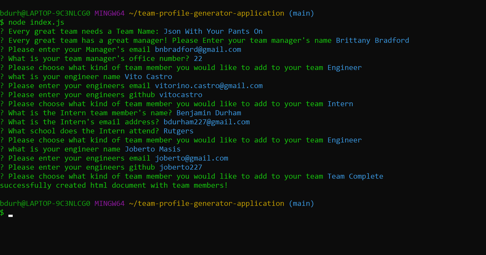
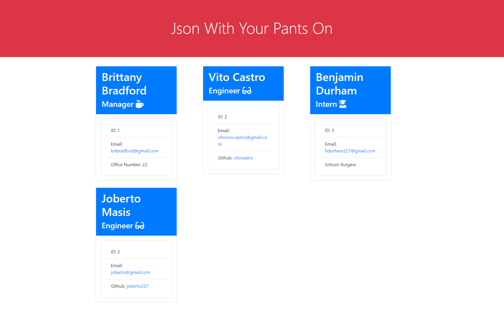

# Team-Profile-Generator-Application

[](https://spdx.org/licenses/MIT.html)
 ## Table of Contents
1. [Description](#description)

2. [Installation](#installation)

3. [Usage](#usage)

4. [Contributions](#contributions)

5. [Questions](#questions)

-----

## Description
 The Team Profile Generator Application is a command line app that generates a Team Profile. This applicaton uses npm inquirer and jest packages to prompt for user inputs and then dynamically creates and renders a html file with their respones. This project uses Object Oriented Programming and Test Driven Development as it's foundation. This application enabled me to build upon and practice my knowledge in the prototype chain and polymorphism. Each class.js file has a corresponding test.js file that pass all tests. This project helped me learn and practice the principles of Object Oriented Programming and Test Driven Development

 -----

 ## Installation
 

   Getting Started:
   * check node is installed
   * npm installed
   * npm initialized
   * npm init
   * package.json and dependencies
  
    node -v
    npm install
    npm init --yes
    npm i inquirer


  


 ## Usage

 ---

 Run the Application:
 


      node index.js

   Run Tests:    
```
   npm test
```


   
Watch Walkthrough video: 
--
[video]
<figure class="video_container">
<iframe src="https://drive.google.com/file/d/1aoNEfzJqW8l4CSBRbfoBA1R3RciC7Cgw/preview" width="640" height="480" allowfullscreen="true"></iframe>
</figure>


Screenshot of Application in Command:
--


Screenshot of Application in Browswer:
--



Visit the Repo: 
[Github]**<https://github.com/bdurham227/The-Quality-ReadMe-Generator>**

   


 ## License
 
[](https://spdx.org/licenses/MIT.html)

   https://opensource.org/licenses/MIT

    Licensed under the MIT License

    Copyright © [2021] [Benjamin Durham]
    

         Permission is hereby granted, free of charge, to any person obtaining a copy of this software and associated documentation files (the "Software"), to deal in the Software without restriction, including without limitation the rights to use, copy, modify, merge, publish, distribute, sublicense, and/or sell copies of the Software, and to permit persons to whom the Software is furnished to do so, subject to the following conditions:
        
        The above copyright notice and this permission notice shall be included in all copies or substantial portions of the Software.
        
        THE SOFTWARE IS PROVIDED "AS IS", WITHOUT WARRANTY OF ANY KIND, EXPRESS OR IMPLIED, INCLUDING BUT NOT LIMITED TO THE WARRANTIES OF MERCHANTABILITY, FITNESS FOR A PARTICULAR PURPOSE AND NONINFRINGEMENT. IN NO EVENT SHALL THE AUTHORS OR COPYRIGHT HOLDERS BE LIABLE FOR ANY CLAIM, DAMAGES OR OTHER LIABILITY, WHETHER IN AN ACTION OF CONTRACT, TORT OR OTHERWISE, ARISING FROM, OUT OF OR IN CONNECTION WITH THE SOFTWARE OR THE USE OR OTHER DEALINGS IN THE SOFTWARE

## Contribution
---

Jason Barbanel
<br>
https://github.com/Jbarbss
<br>
Takuya Matsomoto
<br>
https://github.com/TakuyaMats


 ## Questions
 ---
 For additional questions about usage, installation or application improvement contact me through

Github: https://github.com/bdurham227

Email: bdurham227@gmail.com:

     

